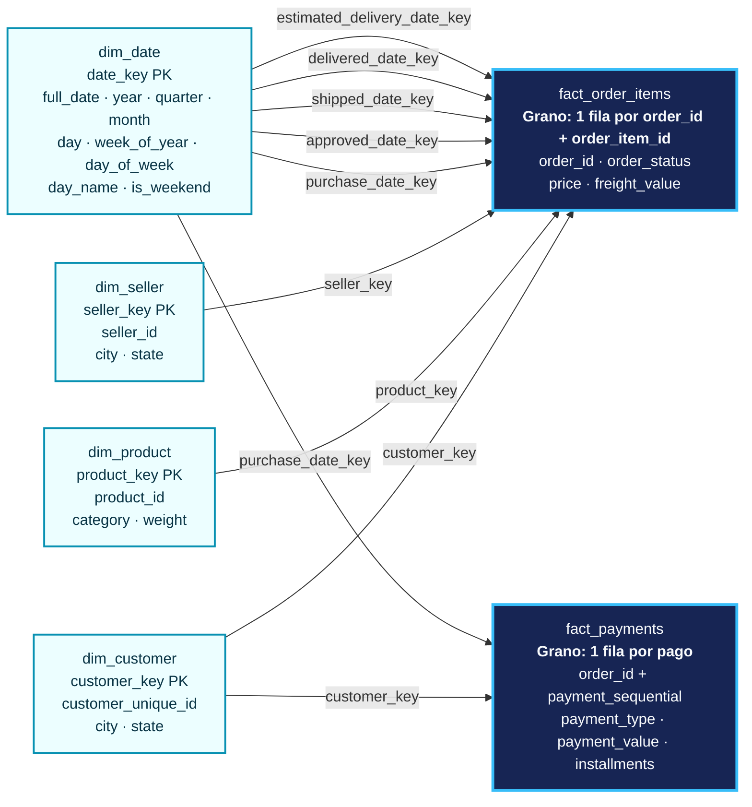
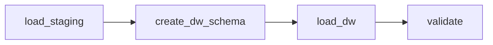
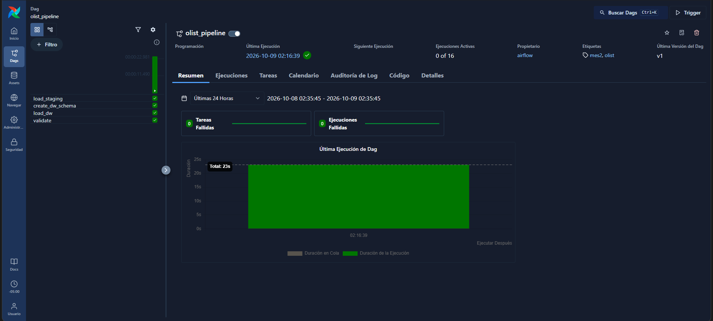

# Olist: modelo dimensional de e-commerce

Proyecto de ingeniería de datos construido sobre el **Brazilian E-Commerce Public Dataset by Olist**. Los CSV se cargan primero tal como llegan a `staging`; después, estos scripts construyen un data warehouse analítico en el esquema `dw`. Todo el flujo está orquestado con **Apache Airflow** sobre Docker.

## Contexto

El dataset contiene pedidos realizados entre 2016 y 2018, con sus clientes, ítems, productos, vendedores, pagos y reseñas. El objetivo es responder preguntas de ventas y entregas sin mezclar tablas con granos incompatibles.

## Modelo estrella



`order_id` es una dimensión degenerada. `order_status` es un atributo de baja cardinalidad que se mantiene en la fact por simplicidad; en un modelo mayor podría extraerse a `dim_order_status`. `dim_date` es una dimensión *role-playing*: la misma tabla se relaciona con cinco significados distintos de fecha.

## Decisiones de modelado

- **Grano de `fact_order_items`:** una fila por `(order_id, order_item_id)`. Por eso las ventas se suman de forma segura desde `price` y `freight_value`.
- **Cliente:** `dim_customer` usa `customer_unique_id`, con una fila por persona. Se aplica SCD tipo 1: la ubicación del pedido más reciente reemplaza las anteriores. Solo 122 de 96.096 personas (0,13 %) aparecen con más de una ciudad, y Olist no ofrece un timestamp de cambio de dirección, así que no es posible construir un SCD tipo 2 confiable sin una regla adicional.
- **Nulos y traducciones:** productos sin categoría, peso o traducción se conservan; las categorías y traducciones faltantes se etiquetan como `unknown`. Dos categorías sin traducción tienen mapeos explícitos en la carga.
- **Pagos:** `fact_payments` se construye como una fact separada porque un pedido puede tener más de un pago (hasta 29). Unir pagos e ítems directamente produciría fan-out e inflaría las ventas.
- **Ventas:** las consultas de ventas excluyen los estados `canceled` y `unavailable`.
- **Ventas mensuales:** se usa un calendario completo y solo meses completos (enero de 2017 a agosto de 2018). Esto evita comparar diciembre con octubre cuando faltan meses en la fuente.

## Requisitos previos

- Windows con PowerShell 7+ o Linux/macOS con una terminal compatible.
- Python 3.10+ y Docker Desktop (o Docker Engine + Compose), con al menos 4 GB de RAM asignados a Docker.
- El [dataset Brazilian E-Commerce Public Dataset by Olist](https://www.kaggle.com/datasets/olistbr/brazilian-ecommerce), descargado y descomprimido en `data/olist/`.

El dataset se publica bajo licencia **CC BY-NC-SA 4.0**. Consulta los términos y la atribución en su página de Kaggle antes de reutilizarlo fuera de un contexto de aprendizaje.

## Orquestación con Airflow

El pipeline completo se ejecuta como un DAG de Airflow (`LocalExecutor`, Airflow 3). Un único `docker-compose.yml` levanta el warehouse (`db`), la base de metadatos de Airflow (`postgres`, separada del warehouse) y los servicios `airflow-apiserver`, `airflow-scheduler` y `airflow-dag-processor`.



| Tarea | Qué hace |
|---|---|
| `load_staging` | Carga los 9 CSV a `staging` (`src/load_olist.py`) |
| `create_dw_schema` | Ejecuta `sql/01_dw_ddl.sql` (puede repetirse sin error) |
| `load_dw` | Ejecuta `sql/02_dw_load.sql` (`TRUNCATE` + `INSERT`, idempotente) |
| `validate` | Ejecuta `sql/03_validations.sql`; falla si el grano o la reconciliación no cuadran |

Decisiones:

- **`schedule=None`:** Olist es un dataset estático, así que el DAG se lanza manualmente.
- **`validate` con `retries=0`:** si los datos no cuadran, reintentar no los arregla. Las demás tareas reintentan 2 veces.
- **Una transacción por archivo SQL:** `src/run_sql.py` ejecuta cada script con `psycopg2` en una sola transacción; un fallo hace rollback y no deja el DW a medias. Equivale a `psql -v ON_ERROR_STOP=1`, que no está disponible dentro del contenedor.
- **Configuración fuera del código:** la conexión (`DB_URL`) y las rutas se leen de variables de entorno definidas en el compose, por lo que los mismos scripts funcionan en local y en Airflow.

Cómo levantarlo:

```powershell
mkdir dags, logs, config, plugins

$key = python -c "import base64,os; print(base64.urlsafe_b64encode(os.urandom(32)).decode())"
@"
AIRFLOW_UID=50000
FERNET_KEY=$key
"@ | Set-Content .env

docker compose build
docker compose up airflow-init
docker compose up -d
```

Abre `http://localhost:8080` (usuario y contraseña de desarrollo: `airflow` / `airflow`), activa `olist_pipeline` y lánzalo con **Trigger**.



Para comprobar que la validación detiene el pipeline, borra una fila de `dw.fact_payments`, limpia la tarea `validate` y verás que falla; al limpiar `load_dw` con *downstream*, el DW se reconstruye y `validate` pasa.

> No uses `docker compose down -v`: el `-v` borra los volúmenes, incluido el del warehouse.

### Pipeline del clima

El DAG `weather_pipeline` (`extract_weather` → `transform_load_weather`) consume la API de Open-Meteo para Lima, guarda el JSON crudo y lo carga a `staging.weather_hourly` con linaje (`_source_file`, `_loaded_at`). `staging` conserva cada carga, y la vista `dw.weather_hourly_latest` deja la más reciente por hora con `ROW_NUMBER()`.

## Ejecución manual (sin Airflow)

Con los CSV de Olist en `data/olist/`:

```powershell
# 1. Instala dependencias, inicia el warehouse y carga los CSV a staging
pip install -r requirements.txt
docker compose up -d db
python src/load_olist.py

# 2. Construye el warehouse y valida
Get-Content -Raw sql/01_dw_ddl.sql | docker compose exec -T db psql -v ON_ERROR_STOP=1 -U de -d warehouse
Get-Content -Raw sql/02_dw_load.sql | docker compose exec -T db psql -v ON_ERROR_STOP=1 -U de -d warehouse
Get-Content -Raw sql/03_validations.sql | docker compose exec -T db psql -v ON_ERROR_STOP=1 -U de -d warehouse

# 3. Ejecuta los ejemplos analíticos
Get-Content -Raw sql/04_business_queries.sql | docker compose exec -T db psql -U de -d warehouse
```

Los comandos anteriores son para **Windows/PowerShell**. En Linux/macOS usa, para cada script:

```bash
docker compose exec -T db psql -v ON_ERROR_STOP=1 -U de -d warehouse < sql/01_dw_ddl.sql
```

Repite el comando cambiando el archivo por `02_dw_load.sql`, `03_validations.sql` y `04_business_queries.sql`, en ese orden.

La bandera `-v ON_ERROR_STOP=1` hace que `psql` se detenga en el primer error y devuelva un código de salida distinto de cero. Sin ella, una validación fallida imprime el error pero el proceso termina como exitoso.

## Validaciones

`sql/03_validations.sql` se ejecuta tras cada carga. Un bloque `DO` falla con `RAISE EXCEPTION` si:

- `order_id` no es único en `olist_orders`.
- `(order_id, order_item_id)` no es único en `olist_order_items`.
- El número de filas o la suma de `price` de `fact_order_items` no coincide con staging.
- El número de filas de `fact_payments` no coincide con staging.

Después muestra conteos informativos (clientes con ubicación múltiple, productos sin categoría o traducción, pedidos con varios pagos) y reconciliaciones de grano de ambas facts. El detalle para inspección manual (por ejemplo, la lista de los 122 clientes con varias ciudades) está en `sql/exploration.sql` y no forma parte del pipeline.

## Consultas de negocio, hallazgos y límites

Las consultas ejecutables están en `sql/04_business_queries.sql`.

1. **Ventas por mes y variación mensual.** Usa una serie de meses completa y `LAG()` para comparar meses consecutivos. Los meses sin ventas aparecen como cero; la variación porcentual es `NULL` si el mes anterior fue cero. Las ventas excluyen pedidos cancelados y no disponibles, pero no equivalen necesariamente a ingresos contables reconocidos.
2. **Top 5 categorías por año.** Usa `DENSE_RANK()` sobre ventas de ítems, excluyendo también `canceled` y `unavailable`. Puede devolver más de cinco categorías si hay empate en el quinto puesto.
3. **Pedidos entregados después de la fecha estimada.** Primero reduce la fact a una fila por pedido; así evita contar varias veces pedidos con varios ítems. Solo considera pedidos con ambas fechas disponibles (es decir, ya entregados) y compara fechas, no horas.

## Resultados

Con la versión pública del dataset cargada en este proyecto, la reconciliación devuelve:

| Métrica | Staging | Data warehouse |
|---|---:|---:|
| Filas de ítems | 112.650 | 112.650 |
| Suma de `price` | 13.591.643,70 | 13.591.643,70 |
| Filas de pagos | 103.886 | 103.886 |

Hallazgos principales:

- El pico de ventas fue **noviembre de 2017**, con **1.003.862,14** en `price`, después de excluir pedidos `canceled` y `unavailable`.
- El **6,77 %** de los pedidos con ambas fechas disponibles (6.535 de 96.476) se entregó después de la fecha estimada.
- **`bed_bath_table`** lideró 2017 con **497.970,94**; **`health_beauty`** lideró 2018 con **770.002,81**. La consulta usa `DENSE_RANK()` para conservar empates.
- La fuente tiene 2.961 pedidos con pagos múltiples, por lo que pagos e ítems no deben unirse directamente.

## Limitaciones y próximos pasos

- `dim_customer` usa SCD tipo 1: la fuente no proporciona la fecha real de cambio de dirección para construir un SCD tipo 2 fiable.
- Los extremos del dataset son parciales: 2016 y septiembre de 2018 contienen pocos datos. Por eso el análisis mensual se limita de enero de 2017 a agosto de 2018.
- La puntualidad compara días (`YYYYMMDD`), no horas; un pedido entregado el mismo día de la estimación no se considera tardío.
- `fact_payments` ya está modelada como fact separada. Una `fact_reviews` queda como trabajo futuro, con su propio grano para evitar fan-out.
- En el pipeline del clima, los archivos crudos se nombran con la hora de ejecución y no con la fecha lógica del DAG, por lo que dos ejecuciones generan dos archivos. La vista `weather_hourly_latest` lo compensa; lo ideal es nombrarlos con `{{ ds }}`.
- Siguiente ciclo: migrar las transformaciones y validaciones a **dbt** (modelos, tests `unique` / `not_null` / `relationships` y documentación), y ejecutar `dbt build` desde Airflow.

## Estructura

```text
dags/
  olist_pipeline.py             # DAG: staging -> dw -> validaciones
  weather_pipeline.py           # DAG: API de clima -> staging
sql/
  01_dw_ddl.sql                 # esquema, dimensiones y hechos
  02_dw_load.sql                # carga idempotente desde staging (TRUNCATE + INSERT)
  03_validations.sql            # controles pasa/falla y reconciliaciones
  04_business_queries.sql       # consultas de negocio
  exploration.sql               # detalle para inspección manual
src/
  load_olist.py                 # CSV -> staging
  run_sql.py                    # ejecuta archivos .sql (usado por Airflow)
  extract_weather.py            # API de clima -> JSON crudo
  transform_load_weather.py     # JSON -> pandas -> staging
docs/
  data-model.md                 # referencia del modelo y sus granos
docker-compose.yml              # warehouse + Airflow
Dockerfile                      # imagen de Airflow con dependencias extra
requirements.txt                # dependencias locales
requirements-airflow.txt        # dependencias dentro de Airflow
```